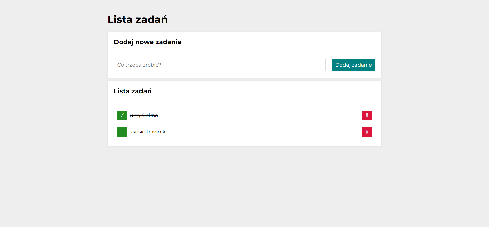

# Aleksandra Jurkiewicz - to do list
## Demo
https://aleksandrajurkiewicz.github.io/to-do-list/

### Simple to do list. 
#### Instruction
1. Type new task content :)
2. Click on button "Dodaj zadanie".
3. Click on green button, if task is done. 
4. Click on red button, if you want to delete task.

#### Used technologies
- JavaScript
- CSS
- HTML
- BEM

